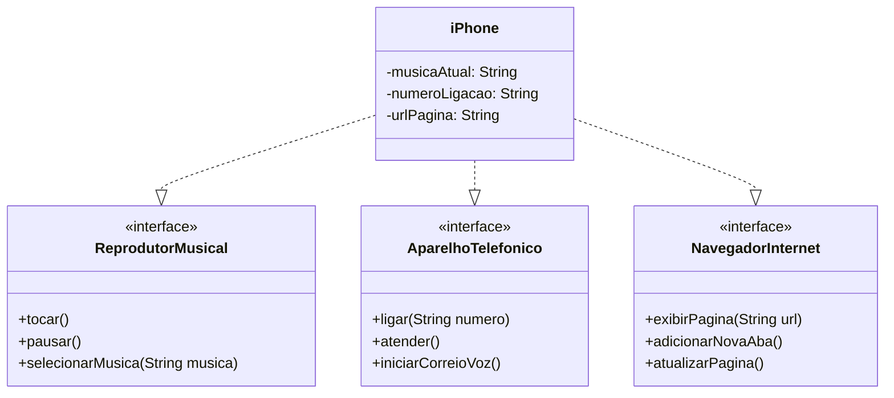

## Diagrama de Classe UML para Componente iPhone

### Descrição do Diagrama

Este diagrama de classes UML descreve a estrutura de um componente iPhone, que implementa as funcionalidades de três interfaces: ReprodutorMusical, AparelhoTelefonico, e NavegadorInternet. Cada interface define um conjunto de métodos que a classe iPhone deve implementar.

### Diagrama de Classe

### Explicação das Classes e Interfaces

#### Interfaces

##### ReprodutorMusical

Define os métodos que um reprodutor musical deve implementar.

* **Métodos:**
    * `tocar()`: Inicia a reprodução da música atual.
    * `pausar()`: Pausa a reprodução da música atual.
    * `selecionarMusica(String musica)`: Seleciona uma música para reprodução.

##### AparelhoTelefonico

Define os métodos que um aparelho telefônico deve implementar.

* **Métodos:**
    * `ligar(String numero)`: Faz uma chamada para o número especificado.
    * `atender()`: Atende uma chamada recebida.
    * `iniciarCorreioVoz()`: Inicia o correio de voz.

##### NavegadorInternet

Define os métodos que um navegador de internet deve implementar.

* **Métodos:**
    * `exibirPagina(String url)`: Exibe a página da URL especificada.
    * `adicionarNovaAba()`: Adiciona uma nova aba no navegador.
    * `atualizarPagina()`: Atualiza a página atual.

#### Classe iPhone

Implementa as interfaces ReprodutorMusical, AparelhoTelefonico, e NavegadorInternet.

* **Atributos:**
    * `musicaAtual: String`: Armazena a música que está sendo reproduzida atualmente.
    * `numeroLigacao: String`: Armazena o número de telefone para o qual está sendo feita uma chamada.
    * `urlPagina: String`: Armazena a URL da página que está sendo exibida no navegador.

* **Relações:**
    * A classe iPhone realiza (implementa) as interfaces ReprodutorMusical, AparelhoTelefonico, e NavegadorInternet, o que é indicado pelas setas de realização (..|>).

### Como o iPhone Implementa as Interfaces

A classe iPhone precisa fornecer implementações concretas para todos os métodos definidos pelas interfaces que implementa. Isso significa que iPhone terá métodos para tocar, pausar, selecionar música, ligar, atender, iniciar correio de voz, exibir páginas, adicionar abas e atualizar páginas.

## Explicação do Projeto

O projeto demonstra a implementação de um componente "iPhone" em Java, usando o conceito de interfaces e classes. O projeto é dividido em quatro arquivos Java:

* **ReprodutorMusical.java:** Define a interface `ReprodutorMusical`, que define os métodos que qualquer classe que implementar essa interface precisa ter. Esses métodos são:
    * `tocar()`: Iniciar a reprodução de música.
    * `pausar()`: Pausar a reprodução de música.
    * `selecionarMusica(String musica)`: Selecionar uma música para reprodução.

* **AparelhoTelefonico.java:** Define a interface `AparelhoTelefonico`, que define os métodos que qualquer classe que implementar essa interface precisa ter. Esses métodos são:
    * `ligar(String numero)`: Fazer uma ligação para um número.
    * `atender()`: Atender uma chamada.
    * `iniciarCorreioVoz()`: Iniciar o correio de voz.

* **NavegadorInternet.java:** Define a interface `NavegadorInternet`, que define os métodos que qualquer classe que implementar essa interface precisa ter. Esses métodos são:
    * `exibirPagina(String url)`: Exibir uma página web.
    * `adicionarNovaAba()`: Adicionar uma nova aba no navegador.
    * `atualizarPagina()`: Atualizar a página atual.

* **iPhone.java:** Define a classe `iPhone`, que implementa as três interfaces (`ReprodutorMusical`, `AparelhoTelefonico` e `NavegadorInternet`). Isso significa que a classe `iPhone` precisa fornecer implementações para todos os métodos definidos nas interfaces. A classe `iPhone` também possui atributos para armazenar a música atual, o número de telefone para a chamada atual e a URL da página web atual.

### Como Executar no VSCode

1. **Configurar o Ambiente:**
    * Certifique-se de ter o Java Development Kit (JDK) e o Visual Studio Code (VSCode) instalados.
    * Instale a extensão "Java Extension Pack" no VSCode.

2. **Criar o Projeto:**
    * Crie uma pasta para o projeto.
    * Crie subpastas `src/main/java` para o código-fonte e `src/test/java` para os testes.
    * Copie os arquivos `ReprodutorMusical.java`, `AparelhoTelefonico.java`, `NavegadorInternet.java` e `iPhone.java` para a pasta `src/main/java`.
    * Crie o arquivo `Test.java` na pasta `src/main/java` para testar o projeto.

3. **Abrir o Projeto no VSCode:**
    * Abra a pasta do projeto no VSCode.

4. **Compilar e Executar:**
    * Abra o terminal integrado no VSCode (`View -> Terminal`).
    * Navegue até a pasta `src/main/java`.
    * Compile o código com o comando `javac *.java`.
    * Execute o código com o comando `java Test`.

### Explicação do Código em `Test.java`

O código em `Test.java` cria uma instância da classe `iPhone` e chama seus métodos para testar as funcionalidades. O código demonstra como usar os métodos de cada interface implementada pela classe `iPhone`:

* **Testando ReprodutorMusical:**
    * `meuIphone.selecionarMusica("Sharks - Imagine Dragons");`
    * `meuIphone.tocar();`
    * `meuIphone.pausar();`

* **Testando AparelhoTelefonico:**
    * `meuIphone.ligar("11999991234");`
    * `meuIphone.atender();`
    * `meuIphone.iniciarCorreioVoz();`

* **Testando NavegadorInternet:**
    * `meuIphone.exibirPagina("https://dio.me");`
    * `meuIphone.adicionarNovaAba();`
    * `meuIphone.atualizarPagina();`

## Considerações Adicionais

* O projeto demonstra como usar interfaces e classes para modelar um sistema, o que é um conceito fundamental na programação orientada a objetos.
* A implementação dos métodos nas classes e interfaces é básica e apenas imprime mensagens no console. Uma implementação real dependeria de bibliotecas e frameworks específicos para cada funcionalidade.

